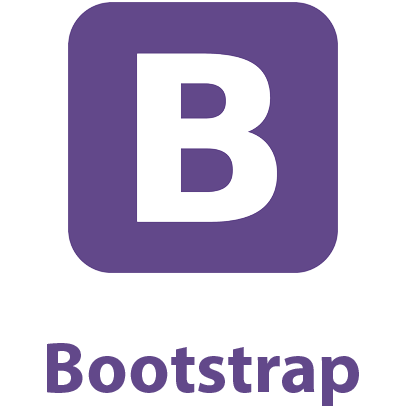

# 👋 Hello! Welcome! I'm [Laura](https://lauracole1900.github.io/react-portfolio/).

### I'm a 👩‍💻 webdev / 🎶 musician / 🥋 martial artist with a background in education and a passion for helping others. Want to know more?

* [My Github](https://github.com/LauraCole1900)
* [My Repositories](https://github.com/LauraCole1900?tab=repositories)
* [My LinkedIn](https://www.linkedin.com/in/laura-cole-3661b01b9/)
* [My Website](https://lauracole1900.github.io/react-portfolio/)
* [My Résumé](https://drive.google.com/file/d/1gOy3CkufWH_k_Y9dVFQYfZc955bPCT25/view)
* [Email me!](mailto:lauracole1900@comcast.net)

|Pinned Repos|Pinned Repos|
|:---:|:---:|
|||
|||
|||
|||
|**GitHub Stats**|**Most-Used Languages**|
|||
|||

<table border="0" align="center">
  <tbody>
    <tr>
      <th colspan="8">Current Skills</th>
    </tr>
    <tr>
      <td align="center" width=75px>
        
      </td>
      <td align="center" width=75px>
        
      </td>
      <td align="center" width=75px>
        
      </td>
      <td align="center" width=75px>
        
      </td>
      <td align="center" width=75px>
        
      </td>
      <td align="center" width=75px>
        
      </td>
      <td align="center" width=75px>
        
      </td>
      <td align="center" width=75px>
        
      </td>
    </tr>
    <tr>
      <td align="center" width=75px>
        
      </td>
      <td align="center" width=75px>
        
      </td>
      <td align="center" width=75px>
        
      </td>
      <td align="center" width=75px>
        
      </td>
      <td align="center" width=75px>
        
      </td>
      <td align="center" width=75px>
        
      </td>
      <td align="center" width=75px>
        
      </td>
    </tr>
  </tbody>
</table>