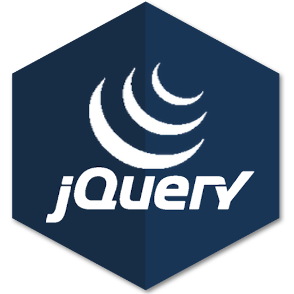
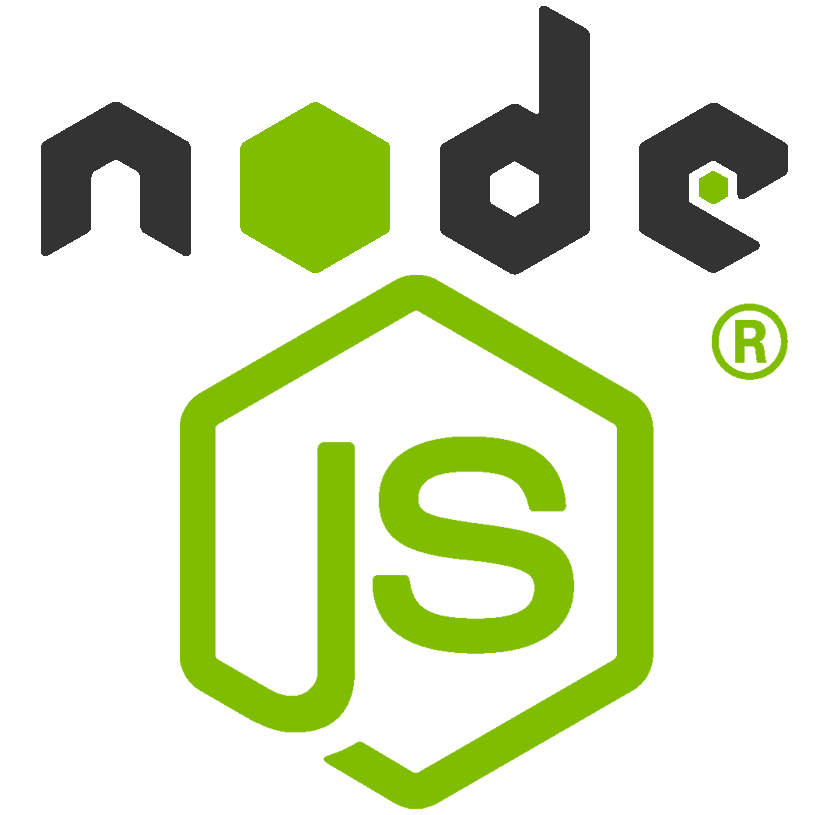
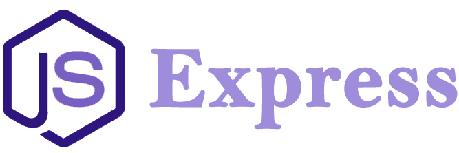
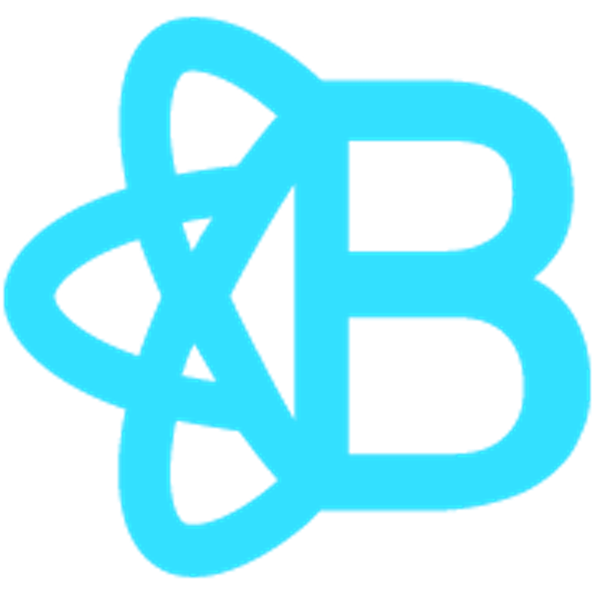
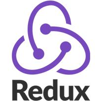

# 👋 Hello! Welcome! I'm [Laura](https://lauracole1900.github.io/LauraECole).

### I'm a 👩‍💻 webdev / 🎶 musician / 🥋 martial artist with a background in education. I get excited about learning new things, and I have a passion for helping others. Want to know more?

* [My Repositories](https://github.com/LauraCole1900?tab=repositories)
* [My LinkedIn](https://www.linkedin.com/in/laura-cole-3661b01b9/)
* [My Website](https://lauracole1900.github.io/LauraECole)
* [My Résumé](https://drive.google.com/file/d/1gOy3CkufWH_k_Y9dVFQYfZc955bPCT25/view)
* [Email me!](mailto:lauracole1900@comcast.net)

|Pinned Repos|Pinned Repos|
|:---:|:---:|
|||
|||
|||
|||
 

|**GitHub Stats**|**Most-Used Languages**|
|:---:|:---:|
|||
||

 

<table border="1px solid white" align="center" color="#2881a5" style="background-color: #040f0f; border: 1px solid white; border-radius: 4px">
  <tbody>
    <tr>
      <th colspan="8" style="color: #2881a5">Current Skills</th>
    </tr>
    <tr>
      <td align="center" width=100px>
        
      </td>
      <td align="center" width=100px>
        
      </td>
      <td align="center" width=100px>
        
      </td>
      <td align="center" width=100px>
        
      </td>
      <td align="center" width=100px>
        
      </td>
      <td align="center" width=100px>
        
      </td>
      <td align="center" width=100px>
        
      </td>
      <td align="center" width=100px>
        
      </td>
    </tr>
    <tr>
      <td align="center" width=100px>
        
      </td>
      <td align="center" width=100px>
        
      </td>
      <td align="center" width=100px>
        
      </td>
      <td align="center" width=100px>
        
      </td>
      <td align="center" width=100px>
        
      </td>
      <td align="center" width=100px>
        
      </td>
      <td align="center" width=100px>
        
      </td>
      <td>
      </td>
    </tr>
    <tr>
      <th colspan="8" style="color: #2881a5">Learning</th>
    </tr>
    <tr>
      <td align="center" width=100px>
        
      </td>
      <td align="center" width=100px>
        
      </td>
      <td>
      </td>
      <td>
      </td>
      <td>
      </td>
      <td>
      </td>
      <td>
      </td>
      <td>
      </td>
    </tr>
  </tbody>
</table>

 

## Credits

  
Resources

* Pinned-repo and stats cards generated by [GitHub Readme Stats](https://github.com/anuraghazra/github-readme-stats) by [Anurag Hazra](https://github.com/anuraghazra)

* GitHub Mark provided by GitHub [here](https://github.com/logos)

* HTML5 and CSS3 icons by <a href="https://pixabay.com/users/b3nj5m1n-5952967/?utm_source=link-attribution&amp;utm_medium=referral&amp;utm_campaign=image&amp;utm_content=2582747">b3nj5m1n</a> from <a href="https://pixabay.com/?utm_source=link-attribution&amp;utm_medium=referral&amp;utm_campaign=image&amp;utm_content=2582747">Pixabay</a>

* Bootstrap icon from pngio.com

* Materialize icon from pngitem.com

* JavaScript and MERN icons from [Wikimedia Commons](https://commons.wikimedia.org/)

* jQuery, Node.js, npm, Express, MySQL, MongoDB, React, and React Bootstrap logos from pngegg.com

